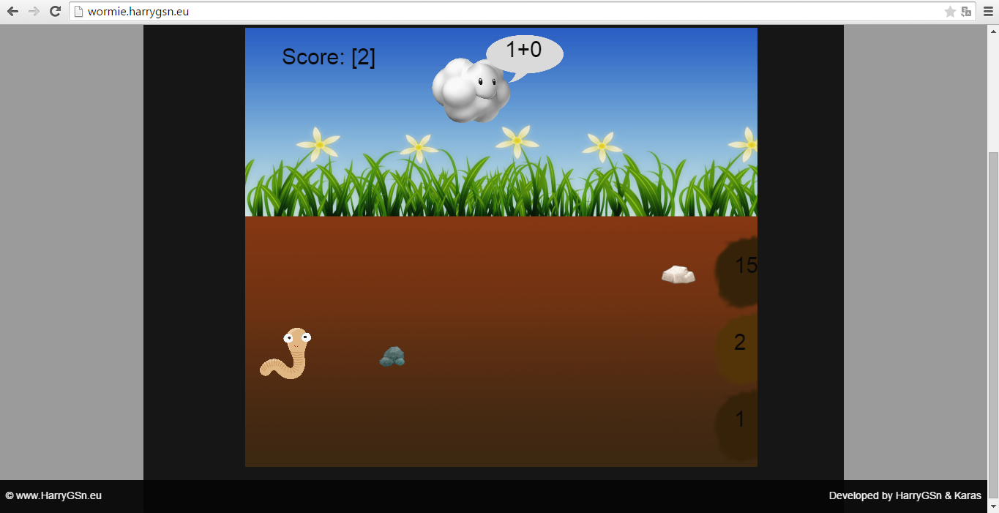
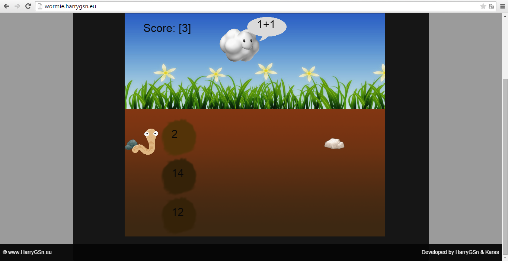

#Εκπαιδευτικό Παιχνίδι "Wormie"

Γιάνναρος Χαράλαμπος Π2012009

Καραφυλλούδης ΣωτήρηςΠ2012044

##Παραδοτέο
- Δημιουργία εκπαιδευτικού παιχνιδιού με χρήση web developing languages ( HTML, javascript, css ) .
Στο εκπαιδευτικό παιχνίδι ,θα πρέπει ο παίκτης να κάνει σωστά αριθμητικές πράξεις έτσι ώστε να βοηθήσει το σκουλικάκι να φάει.

##Τελική Αναφορά Τίτλος WORMIΕ
Το link της (live) εφαρμογής είναι: http://wormie.harrygsn.eu/

##Σύνοψη
Το wormie είναι ένα εκπαιδευτικό παιχνίδι που δημιουργήθηκε στα πλαίσια του  μαθήματος  Τεχνολογία Λογισμικού του ΣΤ' Εξαμήνου του τμήματος Πληροφορικής του Ιονίου Πανεπιστημίου. 

##Εισαγωγή
Πρόκειται για ένα παιχνίδι  που απευθύνεται σε μαθητές Α'-Β' δημοτικού. Το παιχνίδι μπορεί να κεντρίσει το ενδιαφέρον τόσο στα  κορίτσια, όσο και στα αγόρια της ίδιας ή διαφορετικής ηλικίας που απλός τους αρέσει να παίζουν μαθαίνοντας. Σκοπός του παιχνιδιού είναι  να εκπαιδεύσει τα παιδιά στις αριθμητικές πράξεις  καθώς και να τα εξασκήσει επαναλαμβάνοντας τη διαδικασία  μέσω του παιχνιδιού έτσι ώστε να μειώσουν τα λάθη τους.

##Επιλογή Εργαλείων
Τα εργαλεία που χρησιμοποιήθηκαν για την υλοποίηση αυτού του εκπαιδευτικού παιχνιδιού είναι η γλώσσα προγραμματισμού javascript, HTML, css και php

##Διαδικασία Ανάπτυξης
Ξεκινώντας το παιχνίδι εμφανίζεται το περιβάλλον μας με το συννεφάκι που περιέχει τις αριθμητικές πράξεις που είναι προς απάντηση και ο ήρωας του παιχνιδιού μας , το σκουλικάκι , το οποίο επιλέγει μέσω του χρήστη την τρύπα που περιέχει την λύση της αριθμητικής πράξης που περιέχει το συννεφάκι.Οι αριθμητικές πράξεις που εμφανίζονται στον χρήστη για να τους δώσει απάντηση είναι έξι και ανεξαρτήτου σωστών ή λάθος απαντήσεων ο χρήστης φτάνει πάντα στον στόχο ο οποίος είναι να φάει το σκουλικάκι . Επίσης στο παιχνίδι υπάρχει μουσική για να το κάνει πιο ευχάριστο και score που κρατάει τις σωστές απαντήσεις. 
##Ενδεικτικές Οθόνες
-
-
-

##Μελλοντικές Επεκτάσεις
 Επίσης, το παιχνίδι θα μπορούσε να έχει και άλλες αλλαγές ή προσθήκες στον τρόπο λειτουργίας του. Μία προσθήκη θα μπορούσε να είναι στην περίπτωση που ο χρήστης κάνει λάθος στην πράξη να του δίνει την δυνατότητα να ξανά κάνει την ίδια πράξη για να την κάνει σωστά και σε περίπτωση που κάνει δεύτερη φορά λάθος να του δείχνει το σωστό αποτέλεσμα και να προχωράει στην επόμενη πράξη .Μερικές ακόμη αλλαγές-προσθήκες  θα μπορούσε να είναι, η προσθήκη δυνατότητας επιλογής παιχνιδιού με παραπάνω από ένα χρήστη από τον ίδιο υπολογιστή , η συγκέντρωση συγκεκριμένων σωστών απαντήσεων για να φάει το σκουλικάκι δηλαδή ποινικοποίηση , η προσθήκη επιπέδων δυσκολίας καθώς και αριθμητικών πράξεων. Τέλος, θα μπορούσε το παιχνίδι να έχει περισσότερες πίστες. 

##Συμπεράσματα
Τέλος, πρόκειται για ένα παιχνίδι στο οποίο συνυπάρχουν η αφαιρετικότητα και η διάδραση του χρήστη στο χώρο εξέλιξης του παιχνιδιού. Επιπλέον, μέσα από το wormie , το παιδί έχει την δυνατότητα να διασκεδάσει και να ψυχαγωγηθεί ταυτόχρονα, καθώς απαντάει σε μαθηματικές πράξεις, ενώ παράλληλα παίζει
